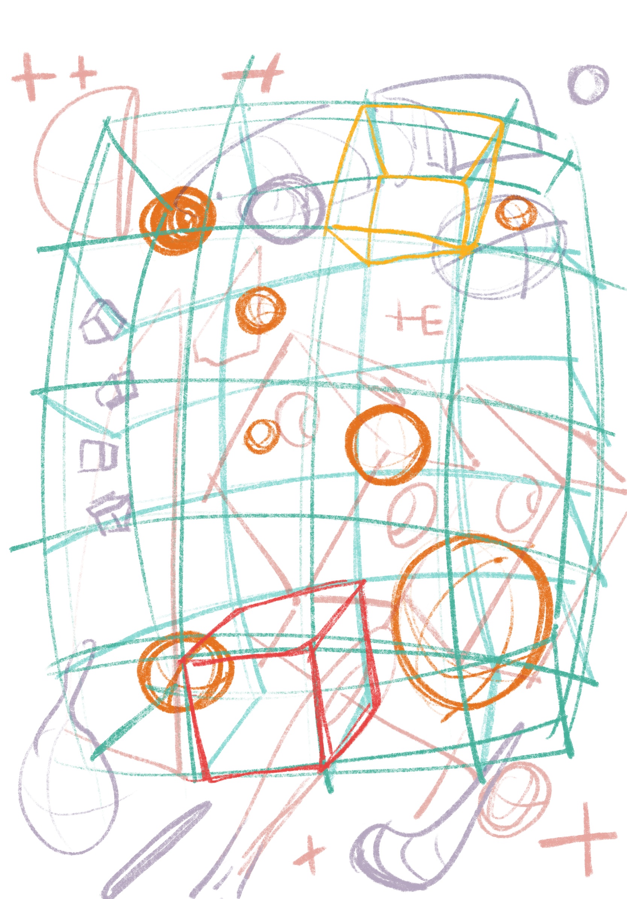
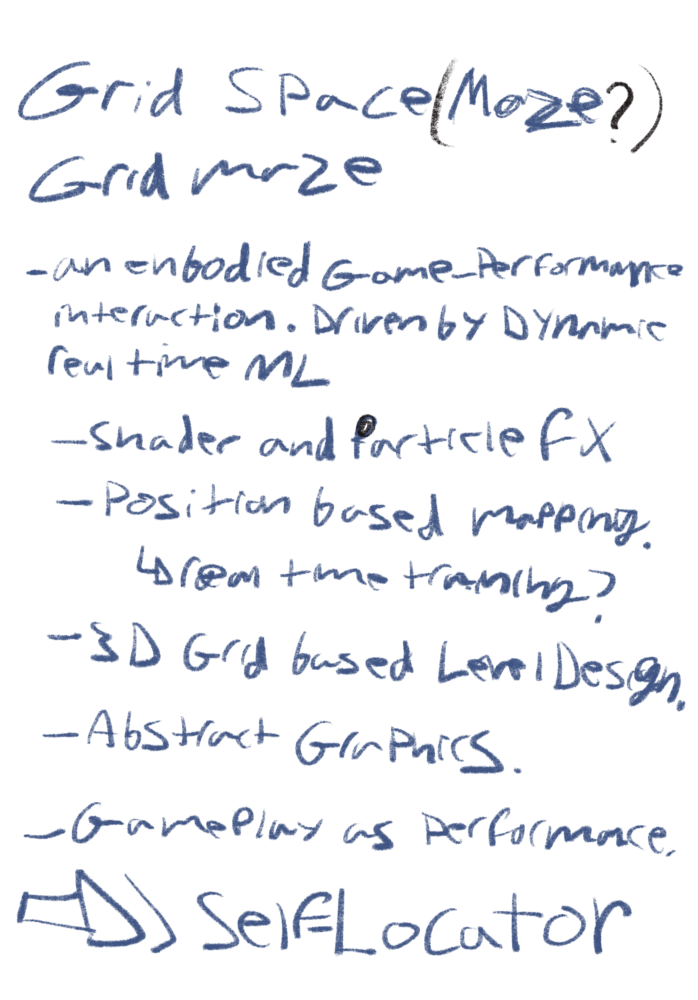
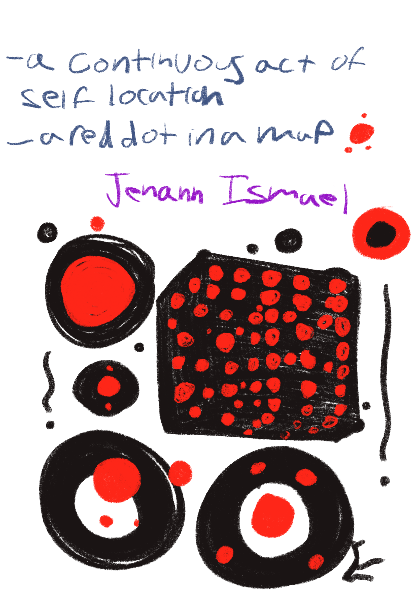

# self-locator
 An embodied ML interaction
## Artist statement:
## Ideation:

 

## Repo structure:
## Technical references:
-  [Advanced Scan Effect PART 1 - Inputs, Blueprints & MPC](https://youtu.be/f5diUsuftEk?si=IqTBDFOUAiPGX3Z9 ) | [Ghislain Girardot](https://www.youtube.com/@ghislaingirardot)

- [Unreal Engine 5.3 - Introduction To HLSL & Scratch Pad In Niagara FX](https://youtu.be/ZNPzpXKvyL4?si=ksjnKMQj2tXugo9B)  | [renderBucket](https://www.youtube.com/@renderbucket)

- [Unreal Engine 5 | Blueprint For Beginners (2023)](https://www.youtube.com/watch?v=Xw9QEMFInYU ) | [SmartPoly](https://www.youtube.com/@SmartPoly)

- [InteractML | Interactive Machine Learning Visual Scripting](https://interactml.com/) 

- [InteractML : Interactive Machine Learning System | UE5 plug in](https://www.unrealengine.com/marketplace/en-US/product/interactml-interactive-machine-learning-system)
## Thematic & artistic references:

- [The Situated Self, J. T. Ismael](https://academic.oup.com/book/2503?login=true)
- Sekamol :
	- https://www.instagram.com/p/Cn7KpsNMrAL/?img_index=1
	- https://www.instagram.com/p/CnuvlvsJCtG/
	- https://www.instagram.com/p/Cmb9b2tpVsZ/
	- https://www.instagram.com/p/CqpkPyJI9sT/
	- https://www.instagram.com/p/CnynC-4gdjn/
	- https://www.instagram.com/p/CnPHVL7ptP9/
- 